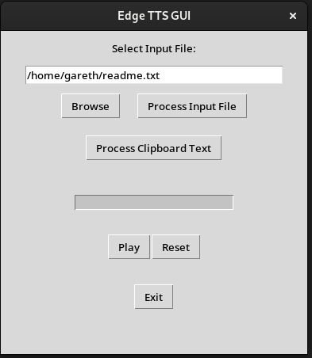

# Linux_TTS_with_Edge Text to Speech

.Application 


This application was developed so that I could have a better screen reader in Linux platform.

I like being able to have the computer to read to me when I'm spending so much time reading.

This small python application that uses the Microsoft Edge Online Text to Speech library to bring naturly speaking language to using your Linux computer.

Its reasonably fast processing and very simple and works 

You can read from the clipboard and from longer txt files.

At the moment it is in English at 1.5x speed as this is the speed I prefer will add option later to allow changes in the GUI.

Step 1: clone git repository
```
git clone https://github.com/GarethLHS/Linux_TTS_with_Edge.git
```

Step 2: install os dependencies
```
Debian
$ apt-get update
$ sudo apt-get install ffmpeg python3 pip

Fedora
$ dnf update
$ sudo dnf install ffmpeg python3 pip
```

Step 3: Install python dependencies
```
pip install asyncio edge_tts tkinter pygame os
```

Step 4: Run the application
```
$ python3 Linux_TTS_with_Edge.py
```
